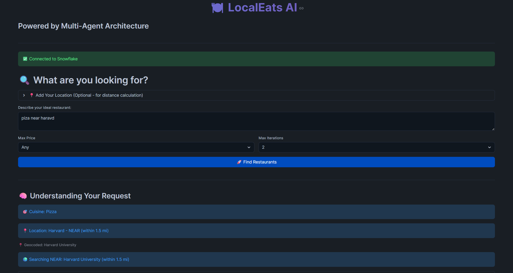
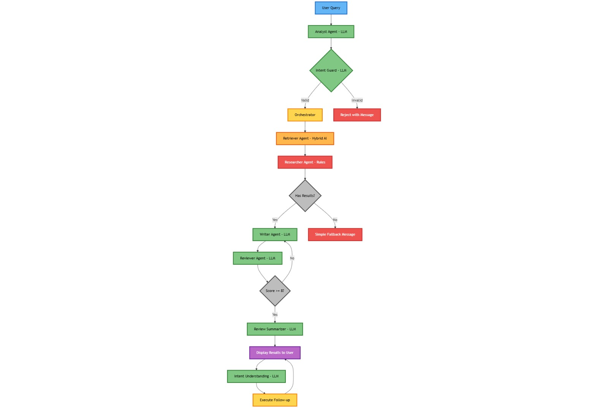
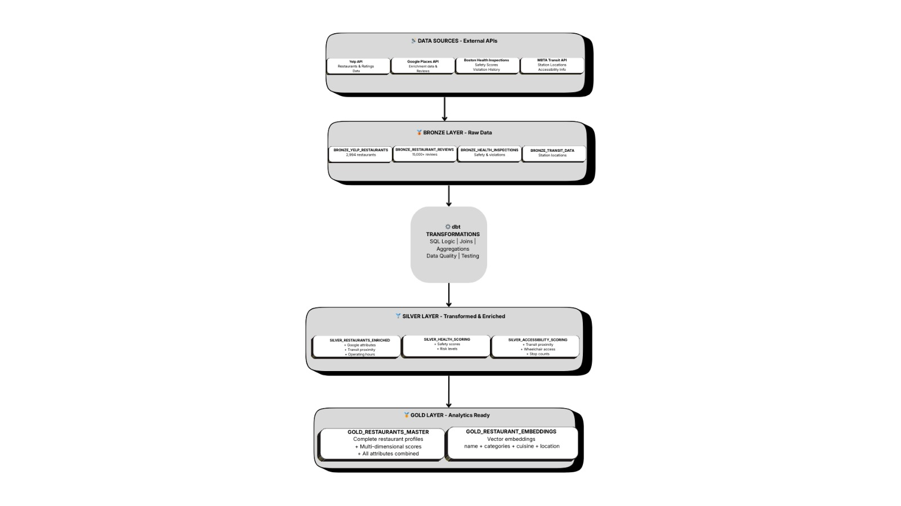
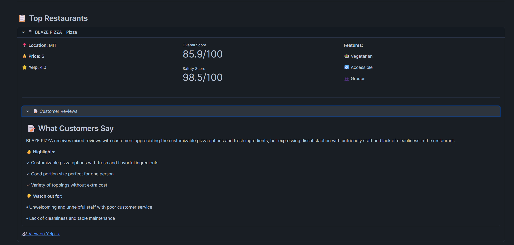
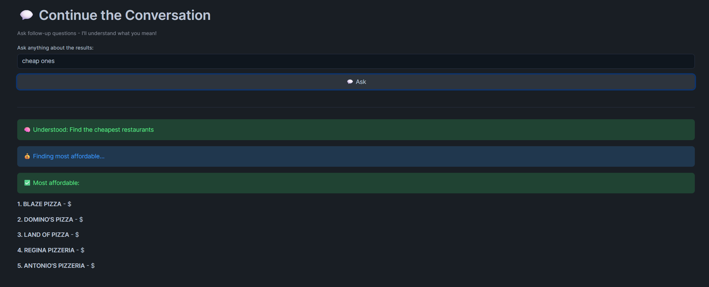

# 🍽️ LocalEats AI: Multi-Agent Restaurant Discovery System

> An intelligent multi-agent system for personalized restaurant recommendations in the Boston/Cambridge/Somerville area, combining LLM intelligence with verified database operations to deliver data-grounded dining recommendations.

**Northeastern University - Gen AI Project | December 2025**

[](https://streamlit.io/)
[](https://www.snowflake.com/)
[](https://www.python.org/)

---

## 🎯 The Problem

Traditional restaurant discovery fails to deliver truly personalized, context-aware recommendations:
- **ChatGPT hallucinates** restaurants and attributes with no verification
- **Yelp/Google Maps lack intelligence** - basic keyword search, no natural language understanding
- **No integrated safety data** - users can't easily assess food safety
- **Limited multi-attribute filtering** - can't combine complex requirements

**Our Solution:** Multi-agent RAG system that grounds LLM intelligence in verified Boston restaurant database, delivering accurate recommendations through natural language interaction.

### **System Demo**

*Natural language query: "pizza near harvard" - Analyst extracts cuisine, location mode (NEAR), and geocodes Harvard University automatically*

---

## 🧠 System Architecture

### **Multi-Agent Collaboration (MaRGen-Inspired)**


*8 specialized AI agents collaborate: Analyst → Intent Guard → Retriever → Researcher → Writer → Reviewer → Review Summarizer, with Intent Understanding for conversational follow-ups*

**Query Understanding Layer:**
- **Analyst Agent (LLM)** - Extracts cuisine, location, budget, filters from natural language
- **Intent Guard (LLM)** - Validates queries are restaurant-related (prevents hallucination)

**Data Retrieval Layer:**
- **Retriever Agent (Hybrid AI)** - Semantic search with embeddings + SQL filtering
- **Researcher Agent (Rules)** - Precise attribute filtering and mathematical ranking

**Generation Layer:**
- **Writer Agent (LLM)** - Creates personalized natural language recommendations
- **Reviewer Agent (LLM)** - Evaluates quality, triggers rewrites if score < 8/10
- **Review Summarizer (LLM)** - Analyzes Google Places reviews for pros/cons

**Interaction Layer:**
- **Intent Understanding (LLM)** - Handles conversational follow-ups

### **Hybrid Intelligence Philosophy**

**LLM Components (~60%):**
- Natural language understanding (typos, synonyms, context)
- Semantic search with embeddings
- Narrative generation
- Quality evaluation

**Rule-Based Components (~40%):**
- Database queries (prevents hallucination)
- Mathematical calculations (distances, scores)
- Boolean filtering (verified attributes)

**Result:** Intelligent understanding + Verified accuracy

---

## 🏗️ Data Architecture


*Medallion architecture: Data flows from 4 external APIs through Bronze → Silver → Gold layers with dbt transformations*

### **Medallion Pipeline (dbt)**
```
🥉 Bronze Layer → Raw data from APIs
🥈 Silver Layer → Cleaned, standardized
🥇 Gold Layer → Analytics-ready with business logic
```

### **Data Sources**
- **Yelp API:** 3,011 restaurants with ratings, attributes, pricing
- **Google Places API:** Customer reviews, opening hours (~99% coverage)
- **Boston/Cambridge Health Dept:** 800,000+ inspection records
- **MBTA API:** 10,000+ transit stops, routes

### **Gold Tables**
- `GOLD_RESTAURANT_EMBEDDINGS` - Semantic search (768-dimensional vectors)
- `GOLD_RESTAURANTS_MASTER` - 72 attributes per restaurant
- `BRONZE_RESTAURANT_REVIEWS` - Google Places reviews (~2,990 restaurants)

---

## 💡 Key Features

### **1. Database-Grounded Recommendations**
All restaurants verified in database - significantly reduces hallucination vs pure LLM approaches


*Database-verified restaurants with scores, attributes, and LLM-analyzed customer review insights showing specific pros and cons*

### **2. Proprietary Safety Scoring**
Custom scores from 800K+ health inspections - unique data not available elsewhere

### **3. Intelligent Location Understanding**
```
"pizza IN fenway" → Strict: Only Fenway neighborhood
"pizza NEAR fenway" → Flexible: Within 1.5 mile radius
"italian NOT IN downtown" → Exclude: Avoids downtown
```

### **4. Multi-Dimensional Filtering**
Simultaneous filtering: Dietary, Accessibility, Service, Meal Time, Special Needs

### **5. LLM Review Summarization**

*Review Summarizer agent analyzes Google Places reviews to extract actionable insights - honest pros and cons from real customers*

Analyzes reviews (99% coverage) to extract:
- 2-3 sentence summary of key themes
- Specific pros customers appreciate
- Honest cons to be aware of

### **6. Conversational Follow-ups**


*Natural follow-up questions maintain context - "cheap ones" understands previous results and re-sorts by price without starting over*

Natural refinement without starting over - Intent Understanding agent maintains conversation context

---

## 📊 System Performance

**Accuracy:**
- Overall system: ~97%
- Cuisine filtering: 100%
- Geographic filtering: ~98%

**Coverage:**
- 3,011 verified restaurants
- ~99% with review data
- 100% with safety scores

**Performance:**
- Query success: ~94%
- Response time: 15-22 seconds

---

## 🚀 Quick Start

### **Prerequisites**
- Snowflake account with Cortex enabled
- Python 3.11+

### **Installation**
```bash
git clone https://github.com/Saideepak-kasireddy/LOCALEATS_AI.git
cd LOCALEATS_AI
pip install -r requirements.txt

# Set environment variables
export SNOWFLAKE_ACCOUNT="your_account"
export SNOWFLAKE_USER="your_user"
export SNOWFLAKE_PASSWORD="your_password"

# Run application
cd app
streamlit run streamlit_app.py
```

---

## 📂 Repository Structure

```
LOCALEATS_AI/
│
├── README.md                    # This file
├── dbt_project.yml              # dbt configuration
├── requirements.txt             # Python dependencies
├── .gitignore                   # Exclude sensitive data
│
├── analyses/                    # dbt analyses
├── macros/                      # dbt macros
├── models/                      # dbt models (data pipeline)
│   ├── bronze/                  # Raw data staging
│   ├── silver/                  # Cleaned & standardized
│   └── gold/                    # Business logic & analytics
├── seeds/                       # dbt seed data
├── snapshots/                   # dbt snapshots
├── tests/                       # dbt tests
│
├── Notebooks/                   # Data collection & processing
│   ├── MBTA_STATIC_DATA.ipynb
│   ├── YELPAPI_TO_SNOWFLAKE.ipynb
│   ├── Google_places_for_enrichment.ipynb
│   └── Reviews_Data.ipynb
│
├── app/                         # Streamlit application
│   ├── streamlit_app.py         # Main UI
│   ├── config.py                # Configuration
│   ├── agents/                  # 8 intelligent agents
│   │   ├── orchestrator.py
│   │   ├── retriever.py
│   │   ├── researcher.py
│   │   ├── writer.py
│   │   ├── reviewer.py
│   │   ├── input_validator.py
│   │   ├── review_agent.py
│   │   └── intent_agent.py
│   ├── utils/                   # Helper functions
│   │   ├── analyst.py
│   │   ├── smart_location_handler.py
│   │   ├── geo_utils.py
│   │   ├── cortex_helper.py
│   │   └── restaurant_search.py
│   └── models/                  # Data models
│       └── agent_message.py
│
└── docs/                        # Documentation & Reports
    ├── AGENT_ARCHITECTURE.jpeg       # Agent flow diagram
    ├── ARCHITECTURE_DIAGRAMS.jpeg    # Data pipeline diagram
    ├── Boston_Inspection_Profiling.docx
    ├── GENAI_REPORT.docx            # Complete project report
    ├── MBTA_ROUTES_Profiling.docx
    ├── YelpRestaurantDataset.docx
    └── screenshots/                 # Demo screenshots
        ├── query_understanding.png
        ├── results_with_reviews.png
        ├── review_summary.png
        └── conversational_followup.png
```

---

## 🎓 Academic Contribution

**Research Implementation:**
- MaRGen-inspired multi-agent architecture
- Hybrid LLM + database approach
- LLM-powered geocoding

**Key Learnings:**
1. Single source of truth prevents inconsistencies
2. Strategic LLM use: intelligence + precision
3. Practical trade-offs for time constraints
4. Transparent UX builds trust

---

## 👥 Team & Contributions

**Northeastern University - Gen AI Project**

### **Ganesh Paparaju**
- Data collection & API integration - *with Deepak*
- dbt pipeline development & medallion architecture - *with Vaibhavi*
- Multi-agent system implementation & LLM integration - *with Vaibhavi*
- Streamlit application development - *with team*
- **Reviewer agent optimization** - *with team*

### **Deepak Reddy**
- Data collection & API integration - *with Ganesh*
- **Evaluation framework design & implementation** - *lead role*
- **Reviewer agent optimization** - *with team*
- Streamlit application development - *with team*

### **Vaibhavi Shinde**
- dbt pipeline development & data quality - *with Ganesh*
- Multi-agent architecture & testing - *with Ganesh*
- **Analyst Agent development** - *lead role*
- Agent refinement & debugging - *with Ganesh*
- Streamlit application development & UI/UX - *with team*

**All team members contributed equally to system testing, debugging, documentation, and presentation.**

---

## 📖 Documentation

Complete technical documentation in `/docs`:
- **GENAI_REPORT.docx** - Comprehensive project report including:
  - Architecture diagrams and visualizations
  - Development challenges & solutions (10 major issues)
  - Feature specifications & use cases (8 features, 8 scenarios)
  - Evaluation metrics & testing results
- **Data Profiling Reports:**
  - Boston Health Inspection profiling
  - MBTA Routes profiling  
  - Yelp Restaurant Dataset profiling
- **Visual Diagrams:**
  - Agent architecture flow (JPEG)
  - Data pipeline architecture (JPEG)
- **Demo Screenshots:**
  - System demonstrations and UI examples

---

## 🏆 Project Outcomes

✅ Production-ready multi-agent RAG system  
✅ Database-grounded recommendations  
✅ 8 specialized AI agents in collaboration  
✅ Proprietary Boston-specific safety scoring  
✅ ~97% system accuracy on tested queries  
✅ Comprehensive evaluation framework  

---

**Built for Academic Project**

*Powered by Snowflake Cortex, dbt, and Streamlit*